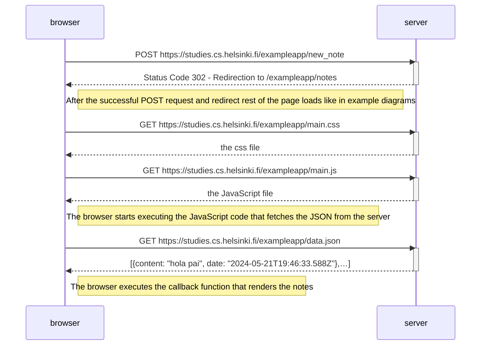

```mermaid
sequenceDiagram
  participant browser
  participant server

  browser->>server: POST https://studies.cs.helsinki.fi/exampleapp/new_note
  activate server
  server-->>browser: Status Code 302 - Redirection to /exampleapp/notes
  deactivate server

  Note right of browser: After the successful POST request and redirect rest of the page        loads like in example diagrams

  browser->>server: GET https://studies.cs.helsinki.fi/exampleapp/main.css
    activate server
    server-->>browser: the css file
    deactivate server
    
    browser->>server: GET https://studies.cs.helsinki.fi/exampleapp/main.js
    activate server
    server-->>browser: the JavaScript file
    deactivate server
    
    Note right of browser: The browser starts executing the JavaScript code that fetches the JSON from the server
    
    browser->>server: GET https://studies.cs.helsinki.fi/exampleapp/data.json
    activate server
    server-->>browser: [{content: "hola pai", date: "2024-05-21T19:46:33.588Z"},…]
    deactivate server    

    Note right of browser: The browser executes the callback function that renders the notes 

```
